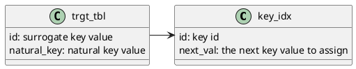

# surrogate key generation
Approaches for surrogate key generation that don't rely on hash functions.

## incrementing key value from block
Assumptions:
There is a service/function that can provide a starting value given a request for N new id's.
The service/function is responsible for maintaining the high water mark.  Want to avoid using "max"
functions on the target table.

The dbt model, then uses this value to generate new key values.

Given a record count, return a starting value and update the high watermark.

