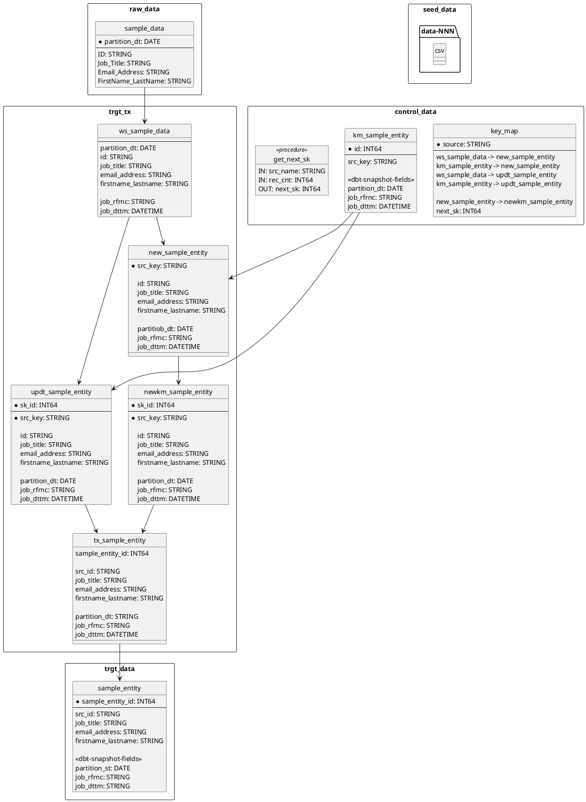

```plantuml
@startuml surrogate key gen data model
hide circle

package trgt_data <<rectangle>> {
    entity sample_entity {
        * sample_entity_id: INT64
        ---
        src_id: STRING
        job_title: STRING
        email_address: STRING
        firstname_lastname: STRING

        << dbt-snapshot-fields >>
        partition_st: DATE
        job_rfrnc: STRING
        job_dttm: STRING
    }
}

package trgt_tx <<rectangle>> {
    entity ws_sample_data {
        ---
        partition_dt: DATE
        id: STRING
        job_title: STRING
        email_address: STRING
        firstname_lastname: STRING

        job_rfrnc: STRING
        job_dttm: DATETIME
    }

    entity updt_sample_entity {
      * sk_id: INT64
      ---
      * src_key: STRING

      id: STRING
      job_title: STRING
      email_address: STRING
      firstname_lastname: STRING

      partition_dt: DATE
      job_rfrnc: STRING
      job_dttm: DATETIME
    }

    entity new_sample_entity {
        * src_key: STRING

        id: STRING
        job_title: STRING
        email_address: STRING
        firstname_lastname: STRING

        partitiob_dt: DATE
        job_rfrnc: STRING
        job_dttm: DATETIME
    }

    entity newkm_sample_entity {
        * sk_id: INT64
        ---
        * src_key: STRING

        id: STRING
        job_title: STRING
        email_address: STRING
        firstname_lastname: STRING

        partition_dt: DATE
        job_rfrnc: STRING
        job_dttm: DATETIME
    }

    entity tx_sample_entity {
        sample_entity_id: INT64

        src_id: STRING
        job_title: STRING
        email_address: STRING
        firstname_lastname: STRING
        
        partition_dt: STRING
        job_rfrnc: STRING
        job_dttm: DATETIME
    }
}

package control_data <<rectangle>> {
    entity key_map {
        * source: STRING
        ---
    ws_sample_data -> new_sample_entity
    km_sample_entity -> new_sample_entity
    ws_sample_data -> updt_sample_entity
    km_sample_entity -> updt_sample_entity

    new_sample_entity -> newkm_sample_entity
    'key_map -> newkm_sample_entity
        next_sk: INT64
    }

    entity km_sample_entity {
        * id: INT64
        ---
        src_key: STRING

        << dbt-snapshot-fields >>
        partition_dt: DATE
        job_rfrnc: STRING
        job_dttm: DATETIME
    }

    object get_next_sk <<procedure>> {
        IN: src_name: STRING
        IN: rec_cnt: INT64
        OUT: next_sk: INT64
    }
}


package raw_data <<rectangle>> {
    entity sample_data {
        * partition_dt: DATE
        ---
        ID: STRING
        Job_Title: STRING
        Email_Address: STRING
        FirstName_LastName: STRING
    }
}

package seed_data <<rectangle>> {
    hide methods
    hide attribute
    entity data-NNN.csv
}

tx_sample_entity --> sample_entity

ws_sample_data --> new_sample_entity
km_sample_entity --> new_sample_entity
ws_sample_data --> updt_sample_entity
km_sample_entity --> updt_sample_entity

new_sample_entity --> newkm_sample_entity

updt_sample_entity --> tx_sample_entity
newkm_sample_entity --> tx_sample_entity
sample_data --> ws_sample_data
@enduml
```